# <center>KotlinWanAndroid</center>
<div align="center">
  
  <br/><br/>
  
  
  
  
  
</div>

## 项目简介
KotlinWanAndroid是以[WanAndroid API](https://www.wanandroid.com/)为基础开发的一款阅读类APP，其主要功能包括：
* **首页**，展示广告栏、置顶文章和最新文章列表；
* **搜索**，提供热门搜索关键词列表和历史搜索关键词列表，可搜索文章；
* **知识体系**，按不同分类展示知识体系，点击可查看分类下的文章；
* **常用网站**，展示常用网站；
* **导航**，按不同工具网站的分类排序，展示各种工具网站的入口；
* **公众号**，按公众号名称展示业内知名大神的公众号最新推送文章；
* **项目**，按项目类型展示网站收录的项目；
* **文章详情**，文章详情页可以关注文章、取关文章、分享文章；
* **登录注册**，登录注册功能对用户身份进行验证，登录后可查看个人收藏列表和日程列表；
* **我的**，我的页面中展示个人收藏列表，可添加站外文章，并提供设置页面和日程页面的入口；
* **设置**，设置页面可以切换自动缓存、无图模式和夜间模式、清除缓存、意见反馈、关于我们、退出登录；
* **日程**，日程页面展示个人所有待办日程，可以添加、修改、删除日程以及查看已完成日程。

## 应用下载
扫码下载应用(Android 4.4+)。如果在使用中发现任何问题或Bug，欢迎issue，或Email：**itgungnir@163.com**


如果上述二维码无法扫描下载，请[点击这里下载APK](https://www.pgyer.com/itgungnir_kwa)

## 功能截屏
|Image Column 01|Image Column 02|Image Column 03|
|---|---|---|
||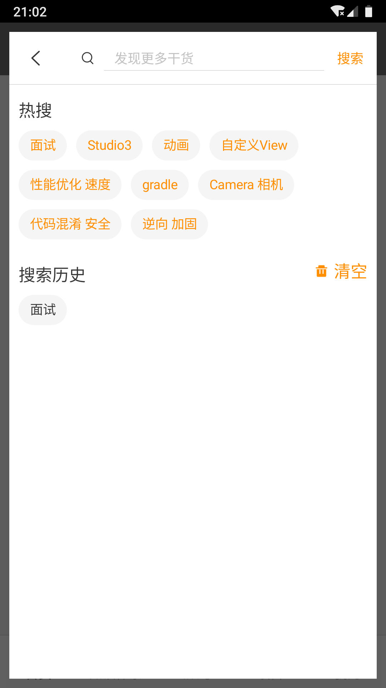|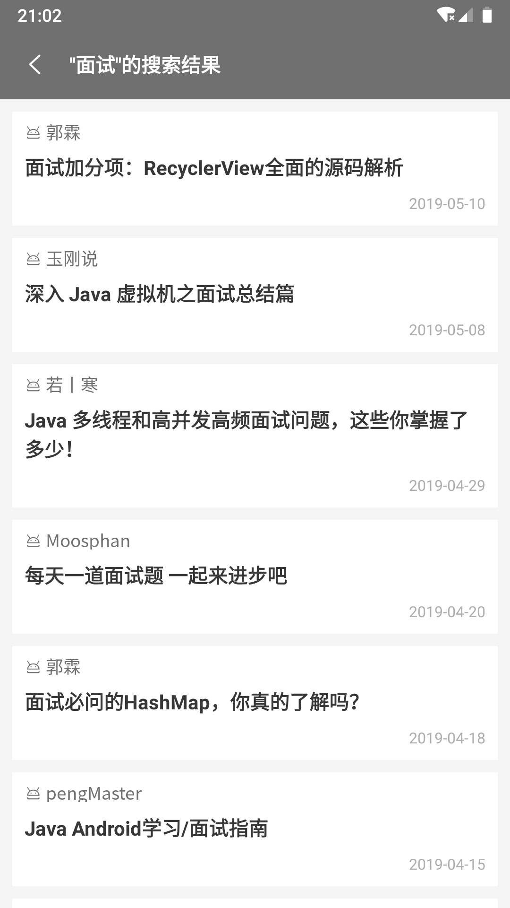|
|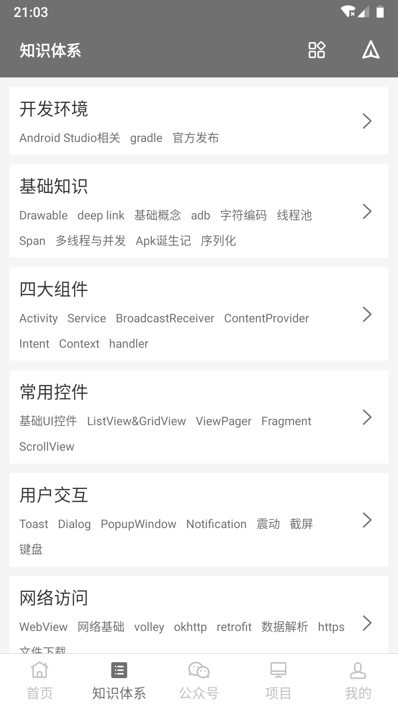||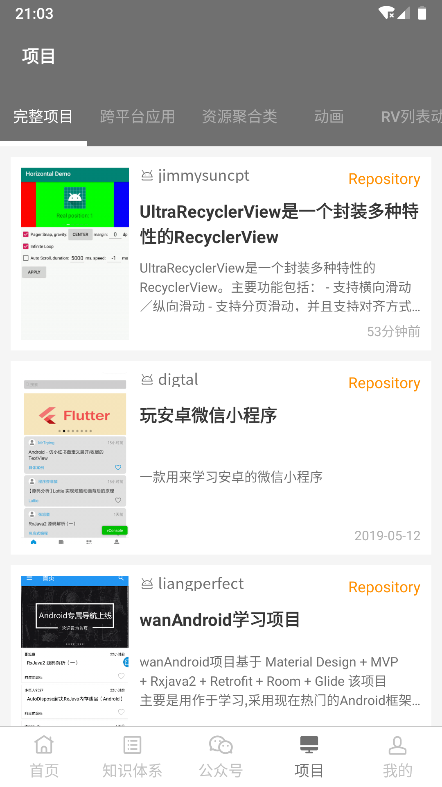|
||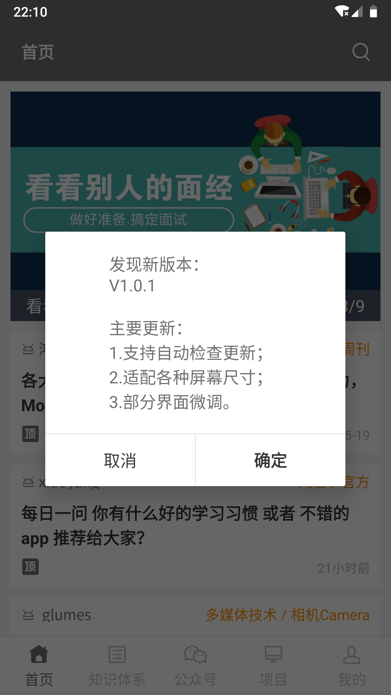||
|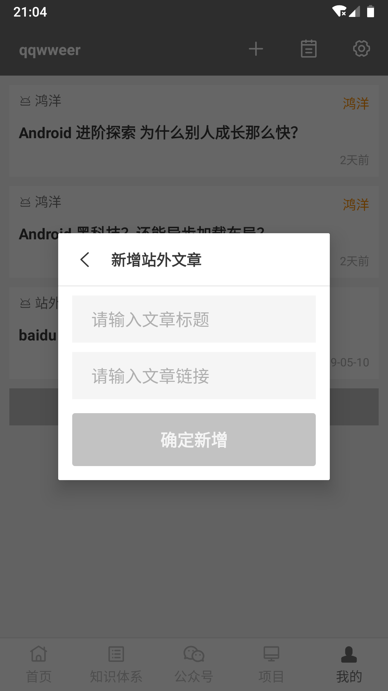|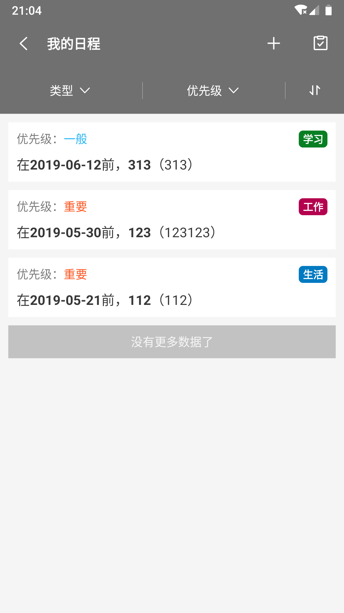|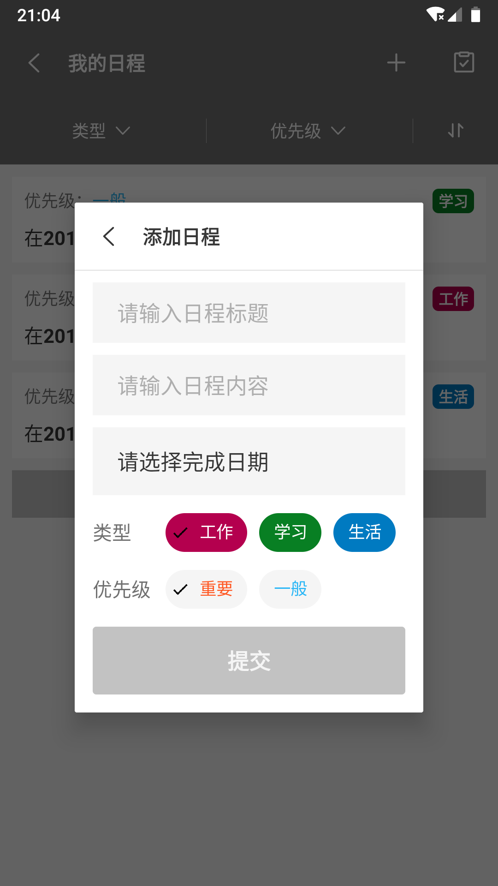|
|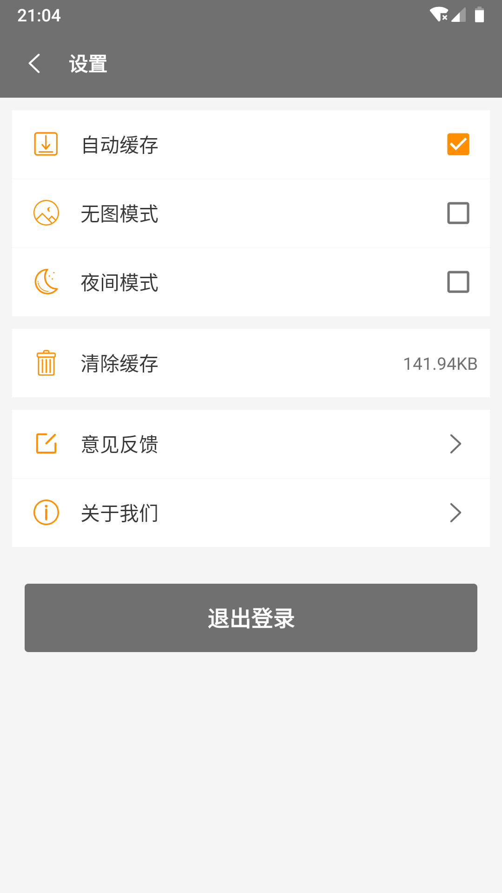|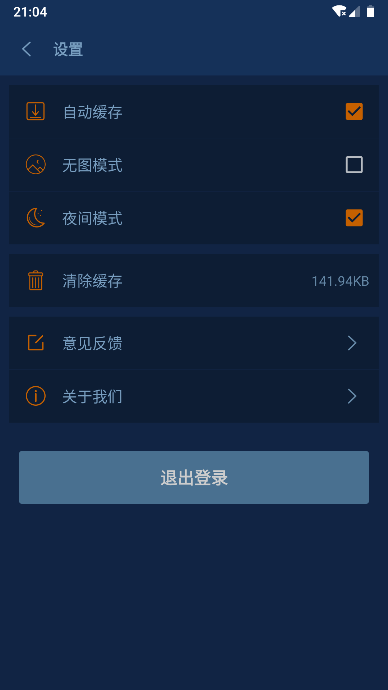||
|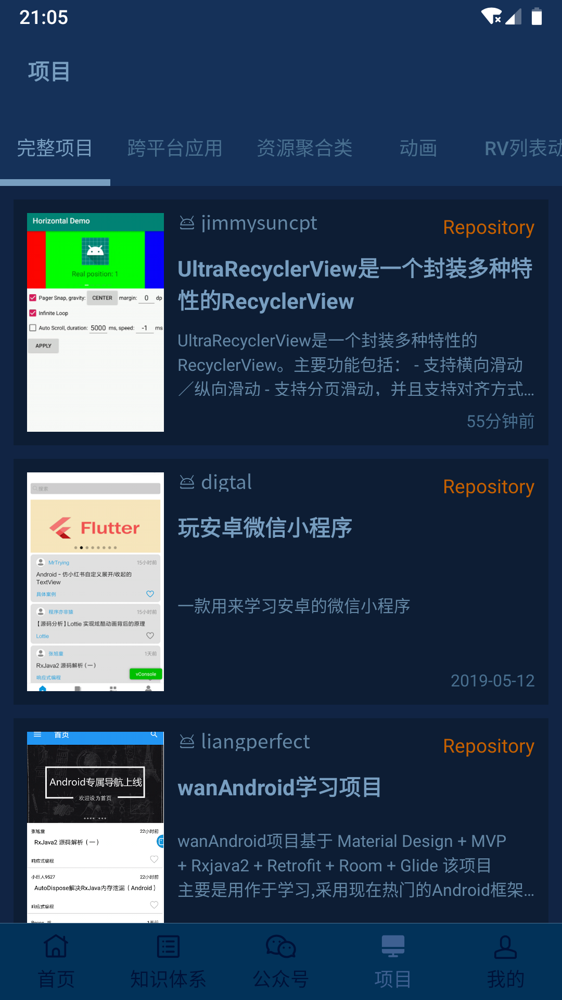||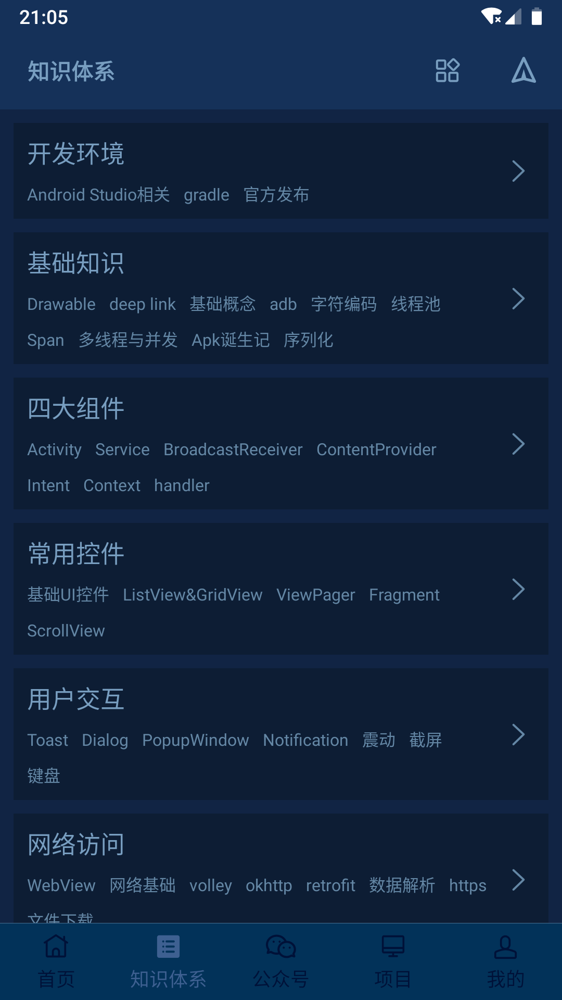|
||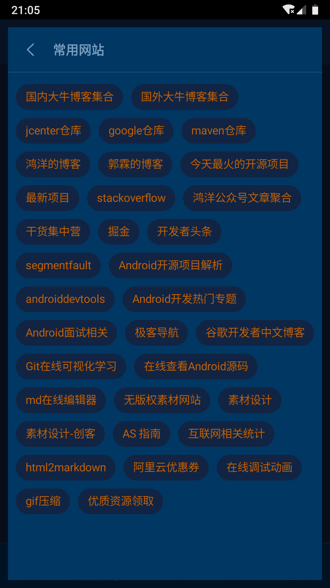|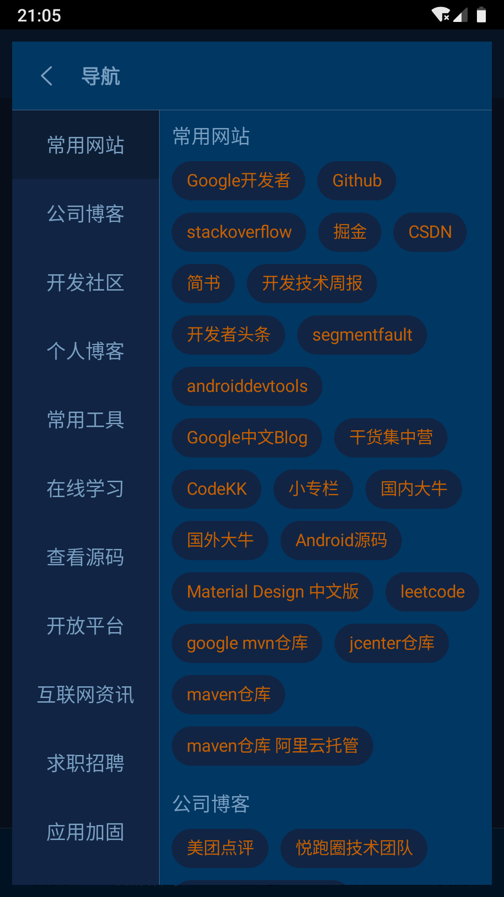|

## 项目架构
本项目共分为四个模块：`app`、`app_main`、`app_support`、`common`，其模块依赖关系如下图所示。

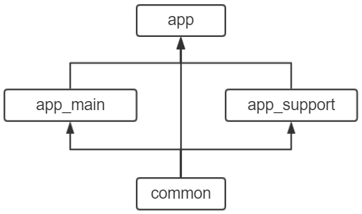

* `app`模块是项目的壳模块，其中仅存放了`App`和项目的入口页面`SplashActivity`；
* `app_main`模块中包含的是`MainActivity`及其中的五个`Fragment`，和点击弹出的各种`Dialog`；
* `app_support`模块是除上述两个模块包含的页面之外的页面；
* `common`模块是项目的通用模块，其中包含了`工具类`、`HTTP相关类`、`Redux的本地实现`等。

具体的技术会在`技术栈`章节中详细介绍。

## 技术栈
`KotlinWanAndroid`，顾名思义是使用`Kotlin`语言开发的`WanAndroid`客户端，在开发过程中使用了很多`Kotlin`的特性，如`多种操作符`、`扩展函数`等，
结合`Kotlin`语言本身简洁的语法进行开发，不仅减少了代码量，也提升了系统性能，关于`Kotlin`语言这里不再赘述。

本应用的开发初衷是：尽量做到简约精致，绝不花里胡哨，这里的花里胡哨不仅是页面上的，也包括依赖库上尽量少的使用必要性低的库，尽量多的自己封装，
这样不仅可以减小应用的体积，也可以提升自己的技术水平。这里主要介绍一下笔者在开发过程中，从项目中抽离封装出来的、与具体业务无关的几个开源库，
这几个开源库力求可以应用于其他`Android`应用的开发中，以使开发更便捷。

### 1、[RxMVVM框架](https://github.com/ITGungnir/RxMVVM)
`RxMVVM`是笔者封装的一个架构框架，其中包括两部分，分别是`对MVVM的封装`和`一种类似于前端Redux的框架`。

对`MVVM`的封装主要是封装出了`BaseActivity`、`BaseViewModel`、`BaseFragment`、`BaseLazyFragment`等组件，使开发更便捷。
`V`层与`VM`层之间通过`LiveData`进行数据交互，真正做到响应式、声明式编程，让代码更加具有可读性和可扩展性。

`RxMVVM`框架中还封装了一种类似于前端的`Redux`框架的代码库，其主要功能是提供一个全局性的状态机，当这个状态机中的数据发生了改变时，
系统中任何一个位置的任何一个组件，都可以监听到这些数据的变化，在`KotlinWanAndroid`项目中，这个库被用来代替传统的`EventBus`等事件总线来使用。

例如，在“我的”页面点击登录按钮跳转到“登录”页面，登录成功后返回“我的”页面加载用户收藏列表。

此处的传统做法是：在`MineFragment`的`onResume()`生命周期中判断用户是否登录，如果已登录则获取数据，
这样做的缺点是每当`MineFragment`进入到用户视线中时都会进行一次判断，不仅无故浪费系统性能，而且要多写很多代码。

如果换成`RxMVVM`中的`Redux`来实现，就简单很多了：只需要在`MineFragment`中监听系统的状态机变化，这样，仅当状态机中的数据发生了变化时，才会去拉去用于收藏的数据。

上述登录的例子只是`Redux`在本系统中诸多应用之一，“收藏文章”、“退出登录”、“切换日/夜间模式”、“切换无图模式”、“切换自动缓存”等功能中都使用了该技术。

### 2、[GRouter](https://github.com/ITGungnir/GRouter)
`GRouter`是一个路由框架。当项目中进行了模块化以后，同级模块之间是不能互相跳转的，因为它们之间没有依赖关系，例如：在本项目中，`app_main`模块中的`MainActivity`组件
想要跳转到`app_support`模块中的`SettingActivity`，如果使用普通的`Intent`方式是做不到（优雅的）跳转的。基于这种场景，`GRouter`诞生了。

`GRouter`的使用方式非常简单：引入依赖、添加`kapt`编译依赖、添加插件、添加注解，然后就可以正常的跳转了，不需要做任何其他额外的配置操作。

`GRouter`中使用了`APT`和`ASM`两种技术，将代码生成、代码注入两部分工作提前到了编译器去做，这也是相比于使用反射手段的一大优势：避免了在运行时生成或注入代码，提升系统性能。

`GRouter`中除了简单的路由跳转，还提供了一些高级操作，如添加全局拦截器、添加路由匹配器等。具体详情请移步到仓库下的`README.md`。

### 3、[UIKit](https://github.com/ITGungnir/UIKit)
`UIKit`是笔者自己封装的一套`UI`库，现在仅用于`KotlinWanAndroid`客户端，虽尚待完善，但已经提供了一些扩展性极高的控件，这里简单介绍几个：
* **Banner**：一个可以自动、无限、循环滚动的广告栏控件，与指示器分离，用户可自己定制指示器；
* **Browser**：基于`AgentWeb`封装的一个网页控件，支持阻绝图片、页内回退、Scheme唤醒、错误页定制等功能；
* **RichText**：富文本生成工具类，支持前景色、背景色、删除线、下划线、加粗、倾斜、点击等多种特效，链式编程，十分方便；
* **HeadBar**：一个封装性极高的标题栏控件，支持定制返回按钮、定制标题、定制工具按钮等；
* **EasyAdapter**：`RecyclerView`的封装，通过简单的代码，可以实现`多ViewType`和`局部刷新`等操作；
* **ListFooter**：一个上滑加载更多的控件；
* **StatusView**：一个控制状态的控件，为不同状态设置不同的布局，然后通过一行代码在不同状态之间切换，常用于列表页加载出错时显示错误页；
* **CommonPage**：阅读类应用的通用页面，由`SwipeRefreshLayout`、`StatusView`和`FAB`组成，通过`Behavior`实现协调。

以上是`UIKit`库中几个比较有代表性的控件的简单介绍，仓库的`README.md`文件中有每个控件的详细介绍和使用文档。

### 4、其他第三方依赖
* **`AndroidX`**：迁移到`AndroidX`；
* **`Retrofit` + `OkHttp` + `RxJava` + `RxAndroid` + `Gson`**：网络请求、线程切换、请求组合等；
* **`OkHttpLoggingInterceptor`**：`OkHttp`的请求日志框架，便于调错；
* **`Glide`**：图片加载框架，可以用很少的代码实现强大的功能，且支持多种图片变换；
* **`RxBinding`**：响应式控件事件监听框架，支持按钮防抖、表单联动等；
* **`FlexBox`**：`Google`开源的流式布局框架，可以结合`RecyclerView`使用；
* **`JodaTime`**：功能强大的时间转换框架，让时间操作更简单；
* **`LeakCanary`**：内存泄漏监测框架，则debug版本中监测并警报内存泄漏；

## Version Log
### V1.2.0
集成了Bugly异常监测SDK

解决首页搜索Dialog没有数据的bug

部分页面的UI微调

添加混淆，缩小应用体积

### V1.1.2
优化部分文本的显示效果

文章详情页功能增强

### V1.1.0
小幅度修改某些页面的布局

增加了屏幕适配功能，在不同尺寸和分辨率的屏幕上有相同展示效果

将应用改为仅能竖屏展示

支持应用自动检查更新

### V1.0.0
`KotlinWanAndroid`的第一版

## Thanks
#### 鸿洋大神提供的[WanAndroid API](https://www.wanandroid.com/blog/show/2)
#### [JsonChao:Awesome-WanAndroid](https://github.com/JsonChao/Awesome-WanAndroid)提供的界面布局思路
#### [Material Design Color Tool](https://material.io/tools/color/)提供的颜色搭配方案
#### 阿里巴巴[IconFont](https://www.iconfont.cn/home/index?spm=a313x.7781069.1998910419.2)提供的图标字体解决方案
#### [BlankJ](https://blankj.com/2018/07/30/easy-adapt-screen/)和[字节跳动技术团队](https://mp.weixin.qq.com/s/d9QCoBP6kV9VSWvVldVVwA)提供的屏幕适配方案
#### [磐龍](https://www.jianshu.com/p/98ea7e866ffd)提供的应用自动检查更新解决方案
#### [蒲公英](https://www.pgyer.com/)提供的APK发布平台
#### [Bugly](https://bugly.qq.com/v2/index)提供的异常/错误监测解决方案
#### 系统中用到的三方库
[Rxjava](https://github.com/ReactiveX/RxJava)、
[RxAndroid](https://github.com/ReactiveX/RxAndroid)、
[RxBinding](https://github.com/JakeWharton/RxBinding)、
[Retrofit](https://github.com/square/retrofit)、
[OkHttp](https://github.com/square/okhttp)、
[Gson](https://github.com/google/gson)、
[Glide](https://github.com/bumptech/glide)、
[FlexBoxLayout](https://github.com/google/flexbox-layout)、
[JodaTimeAndroid](https://github.com/dlew/joda-time-android)、
[LeakCanary](https://github.com/square/leakcanary) 等
#### 感谢开源和喜欢开源的各位大佬，让编程更美好！

## License
```text
Copyright 2019 ITGungnir

Licensed under the Apache License, Version 2.0 (the "License");
you may not use this file except in compliance with the License.
You may obtain a copy of the License at

    http://www.apache.org/licenses/LICENSE-2.0

Unless required by applicable law or agreed to in writing, software
distributed under the License is distributed on an "AS IS" BASIS,
WITHOUT WARRANTIES OR CONDITIONS OF ANY KIND, either express or implied.
See the License for the specific language governing permissions and
limitations under the License.
```